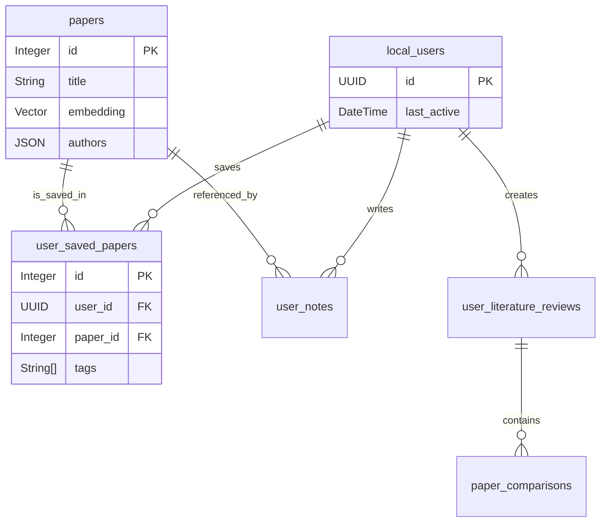

# Database Structure & Data Analysis

## Overview
The application uses **PostgreSQL** as the primary relational database. It leverages the **SQLAlchemy ORM** for data modeling in the backend.

**Key Features:**
- **pgvector Extension**: Stores vector embeddings for semantic search.
- **Relational Integrity**: Enforces foreign key constraints between users, papers, and user-generated content.
- **Optimized IDs**: Uses UUIDs for users and standardized IDs for papers (DOI, arXiv ID).

## 🗄️ Core Tables

### 1. `papers` (The Knowledge Base)
This is the central table where all research papers (cached from external sources) are stored.
- **Primary Key**: `id` (Integer)
- **Unique Identifiers**: `doi`, `arxiv_id`, `semantic_scholar_id`, `openalex_id` (Indexed for fast lookups).
- **Content**: `title`, `abstract`, `authors` (stored as JSON), `publication_date`.
- **Search Optimization**: 
    - `embedding`: Vector(768) column for semantic search.
    - `category`: Filters results by domain (e.g., `ai_cs`).
    - `is_processed`: Boolean flag to track if embeddings have been generated.
- **Deduplication**: Logic merges papers from different sources (arXiv, Semantic Scholar) based on `doi` or fuzzy title matching (`SequenceMatcher`).
- **Performance**:
    - **Bulk Insert**: New papers are inserted using `bulk_insert_mappings` for speed.
    - **Lazy Loading**: Embeddings are generated in background tasks to keep the API responsive.

### 2. `local_users` (User Management)
Represents a user session. No passwords are stored; uses a "local session" model.
- **Primary Key**: `id` (UUID).
- **Metadata**: `created_at`, `last_active`.
- **Relationships**: One-to-Many to `user_saved_papers`, `user_notes`, etc.

### 3. User Data Tables
Tables linking users to papers or storing user content.
- **`user_saved_papers`**:
    - Links `local_users.id` and `papers.id`.
    - Stores `tags`, `personal_notes`, `read_status`.
- **`user_notes`**:
    - Hierarchical note-taking system.
    - `parent_id` allows folders and nested notes.
    - Connects to `papers.id` (optional, for specific paper notes) and `local_users.id`.
- **`user_search_history`**:
    - Logs user queries (`query`, `category`, `results_count`) for analytics and history display.

### 4. Analysis & Review Tables (Advanced)
- **`user_literature_reviews`**: Projects grouping multiple papers.
- **`paper_comparisons`**: Stores comparison matrices between papers.
- **`literature_review_findings`**: Key findings extracted from specific reviews.

## 🔗 Connections

### Connection to Backend
- **SQLAlchemy Models**: Defined in `backend/app/models/`.
    - `paper.py` -> `papers` table.
    - `user_models.py` -> All user-related tables.
- **Session**: `backend/app/core/database.py` manages the connection pool.

### Connection to Frontend
The frontend does **not** connect directly to the database. It interacts via the API:
- **Display**: Frontend fetches JSON representations of these tables.
    - `SearchResult` component displays data from `papers`.
    - `Library` component displays joined data from `user_saved_papers` + `papers`.
- **Actions**:
    - "Save Paper" button -> POST to API -> Inserts row in `user_saved_papers`.
    - "Create Note" -> POST to API -> Inserts row in `user_notes`.

## 📐 Entity Relationship Diagram (Conceptual)

